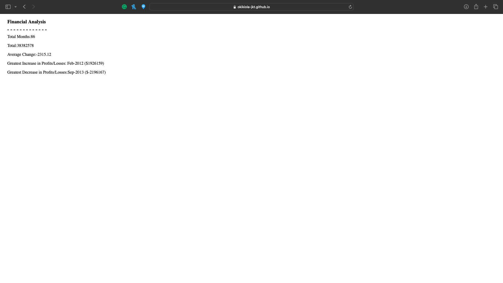

# Financial Analysis

**Project Description**

Performing financial analalysis using Javascript.

The questions below were answered with the provided dataset:

* The total number of months included in the dataset.
* The net total amount of Profit/Losses over the entire period.
* The average of the changes in Profit/Losses over the entire period.
* The greatest increase in Profit/Losses (date and difference in the amounts) over the entire
  period.
* The greatest decrease in Profit/Losses (date and difference in the amounts) over the entire
  period.

